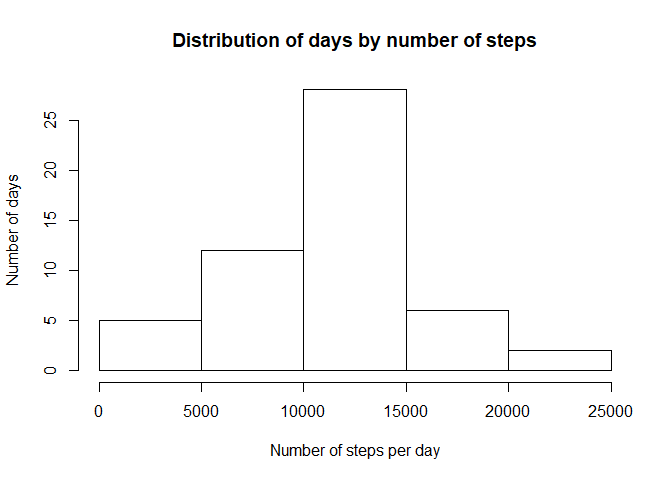
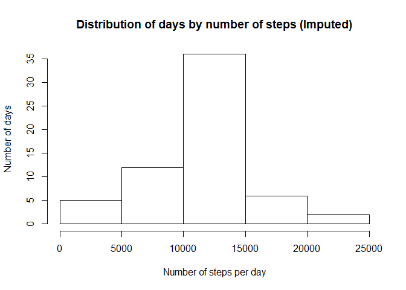
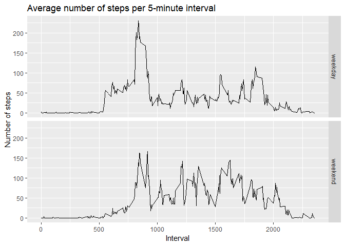

## Loading and preprocessing the data

```r
# Load data from csv-file:    
df <- read.csv("activity.csv")

# Change column-type for column date:
df$date <- as.Date(df$date, format="%Y-%m-%d")
```

## What is mean total number of steps taken per day?

```r
#####################################################################
# 1. Make a histogram of the total number of steps taken each day

# Aggregate steps by day:
library(dplyr)
```

```
## 
## Attaching package: 'dplyr'
```

```
## The following objects are masked from 'package:stats':
## 
##     filter, lag
```

```
## The following objects are masked from 'package:base':
## 
##     intersect, setdiff, setequal, union
```

```r
steps_0 <- select(df, date, steps)
steps_1 <- filter(steps_0, !is.na(steps))
steps_2 <- group_by(steps_1, date)
steps_total <- summarize(steps_2, steps = sum(steps))

# Delete temporary data sets:
rm(list=c("steps_0", "steps_1", "steps_2"))

# Plot histogram of total (sum) of steps per day:
title <- "Distribution of days by number of steps"
xlab <- "Number of steps per day"
ylab <- "Number of days"

hist(steps_total$steps, xlab=xlab, ylab=ylab, main=title)
```

<!-- -->

```r
#####################################################################
# 2.Calculate and report the **mean** and **median** total number of steps taken per day

steps_mean <- mean(steps_total$steps)
steps_med <- median(steps_total$steps)
```

 - The **mean** number of steps per day is equal to 1.0766189\times 10^{4}.
 - The **median** number of steps per day is equal to 10765.

## What is the average daily activity pattern?

```r
#####################################################################
# 1. Make a time series plot (i.e. type = "l") of the 5-minute interval (x-axis) and the average number of steps taken, averaged across all days (y-axis)

dp_0 <- select(df, interval, steps)
dp_1 <- filter(dp_0, !is.na(steps))
dp_2 <- group_by(dp_1, interval)
dp_data <- summarize(dp_2, steps_ave = mean(steps))

# Delete temporary data sets:
rm(list=c("dp_0", "dp_1", "dp_2"))

# Plot data:
title <- "Average number of steps per 5-minute interval"
xlab <- "Interval"
ylab <- "Number of steps"

plot(x=dp_data$interval, y=dp_data$steps_ave, type="l", main=title, xlab=xlab, ylab=ylab)
```

<!-- -->

```r
#####################################################################
# 2. Which 5-minute interval, on average across all the days in the dataset, contains the maximum number of steps?

max_ave_steps <- dp_data[which.max(dp_data$steps_ave), "interval"]
```

On average, the maximum number of steps is taken on interval 835.

## Imputing missing values

```r
#####################################################################
# 1. Calculate and report the total number of missing values in the dataset (i.e. the total number of rows with NAs)

nmiss <- sum(is.na(df))
```

The **number of missing values** in the data set is equal to 2304.


```r
#####################################################################
# 2. Devise a strategy for filling in all of the missing values in the dataset. The strategy does not need to be sophisticated. For example, you could use the mean/median for that day, or the mean for that 5-minute interval, etc.

# Strategy: Reuse data set dp_data with mean per interval.

#####################################################################
# 3. Create a new dataset that is equal to the original dataset but with the missing data filled in.

new_df_0 <- merge(df, dp_data, by="interval")
new_df_1 <- mutate(new_df_0, steps = coalesce(as.numeric(steps),steps_ave))
new_df <- select(new_df_1, date, interval, steps)
new_df <- arrange(new_df, date, interval)

# Delete temporary data sets:
rm(list=c("new_df_0", "new_df_1"))

#####################################################################
# 4. Make a histogram of the total number of steps taken each day and Calculate and report the mean and median total number of steps taken per day. Do these values differ from the estimates from the first part of the assignment? What is the impact of imputing missing data on the estimates of the total daily number of steps?

# Aggregate steps by day:
newsteps_0 <- select(new_df, date, steps)
newsteps_1 <- filter(newsteps_0, !is.na(steps))
newsteps_2 <- group_by(newsteps_1, date)
newsteps_total <- summarize(newsteps_2, steps = sum(steps))

# Delete temporary data sets:
rm(list=c("newsteps_0", "newsteps_1", "newsteps_2"))

# Plot histogram of total (sum) of steps per day:
title <- "Distribution of days by number of steps (Imputed)"
xlab <- "Number of steps per day"
ylab <- "Number of days"

hist(newsteps_total$steps, xlab=xlab, ylab=ylab, main=title)
```

<!-- -->

```r
# Calculate the mean and median number of steps per day on the imputed data:
newsteps_mean <- mean(newsteps_total$steps)
newsteps_med <- median(newsteps_total$steps)
```

The **mean** number of steps per day calculated on the imputed data set is equal to 1.0766189\times 10^{4}, compared to 1.0766189\times 10^{4} for the original data set.

The **median** number of steps per day calculated on the imputed data set is equal to 1.0766189\times 10^{4}, compared to 10765 for the original data set.

## Are there differences in activity patterns between weekdays and weekends?

```r
#####################################################################
# 1. Create a new factor variable in the dataset with two levels -- "weekday" and "weekend" indicating whether a given date is a weekday or weekend day.

# Set system to English language:
Sys.setlocale(category = "LC_TIME", locale = "English_United States.1252")
```

```
## [1] "English_United States.1252"
```

```r
# Create factor variable dayType:
actpat_1 <- mutate(new_df, day = weekdays(date, abbreviate=TRUE), 
                    dayType = factor(ifelse(day == "Sat" | day == "Sun", "weekend", "weekday"))
                    )
actpat_data <- select(actpat_1, date, interval, steps, dayType)

#####################################################################
# 2. Make a panel plot containing a time series plot (i.e. type = "l") of the 5-minute interval (x-axis) and the average number of steps taken, averaged across all weekday days or weekend days (y-axis). 

# Prepare data:
panel_1 <- select(actpat_data, dayType, interval, steps)
panel_2 <- group_by(panel_1, dayType, interval)
panel_data <- summarize(panel_2, steps_ave = mean(steps))

# Plot:
library(ggplot2)

title="Average number of steps per 5-minute interval"
xlab="Interval"
ylab="Number of steps"

ggplot(data= panel_data, aes(x=interval, y=steps_ave)) +
           geom_line() +
           facet_grid( dayType ~ .) +
            labs(title=title, x=xlab, y=ylab)
```

<!-- -->
